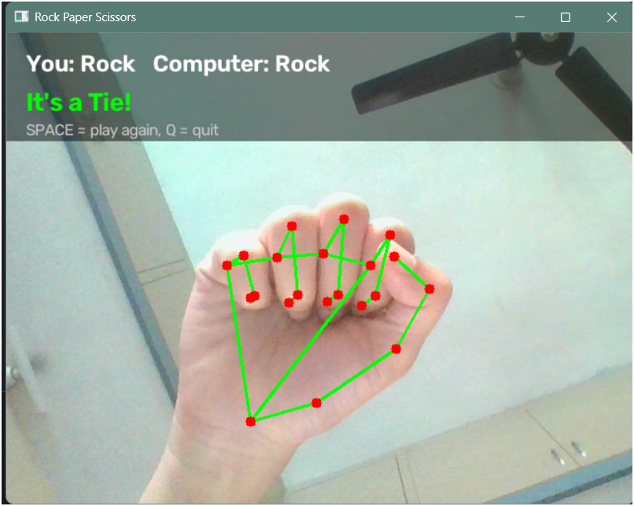
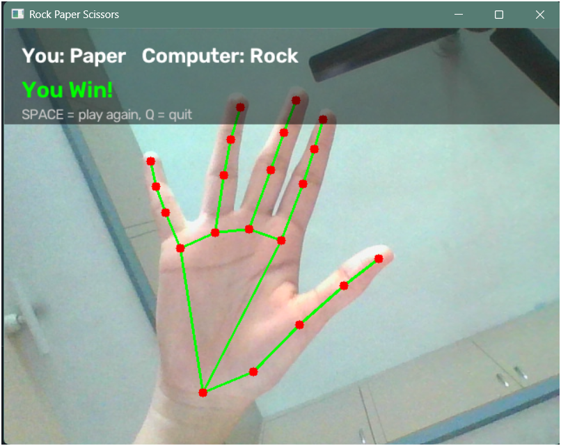

# Rock Paper Scissors - Computer Vision

Play Rock Paper Scissors against your computer using only your webcam and
your hand. Gestures are
recognized with simple rule-based geometry on MediaPipe's 21 hand landmarks.

## Features

- Real-time webcam hand tracking with MediaPipe's current **Tasks API**
  (`HandLandmarker`, not the deprecated `mp.solutions.hands`)
- Visual skeleton overlay of the 21 detected hand landmarks
- Rule-based gesture classification: Rock / Paper / Scissors / Unknown
- Simple game state machine: Waiting -> Countdown -> Capture -> Result
- Random computer move and automatic winner detection
- Clean, single-file, beginner-friendly implementation

## Project structure

```text
rock-paper-scissors/
│
├── main.py
├── requirements.txt
└── README.md
```

## Installation

1. Make sure you have **Python 3.9 - 3.12** installed (MediaPipe does not
   yet support the very latest Python versions).
2. (Recommended) create a virtual environment:
   ```bash
   python -m venv venv
   source venv/bin/activate      
   # on Windows: venv\Scripts\activate
   ```
3. Install the dependencies:
   ```bash
   pip install -r requirements.txt
   ```

## How to run

```bash
python main.py
```

The first time you run it, the script automatically downloads the small
`hand_landmarker.task` model file (a few MB) from Google's MediaPipe model
storage. You'll need an internet connection for that one-time download;
after that, it's saved locally and reused.

## Controls

| Key     | Action                     |
|---------|-----------------------------|
| `SPACE` | Start a new round (begins the countdown) |
| `Q`     | Quit the game                |

## How gesture recognition works

MediaPipe's `HandLandmarker` returns **21 landmarks** per detected hand,
each with normalized `(x, y, z)` coordinates (0.0 to 1.0 across the image).
The landmarks we use:

| Landmark index | Meaning |
|---|---|
| 0 | Wrist |
| 1-4 | Thumb (CMC, MCP, IP, **Tip**) |
| 5-8 | Index finger (MCP, PIP, DIP, **Tip**) |
| 9-12 | Middle finger (MCP, PIP, DIP, **Tip**) |
| 13-16 | Ring finger (MCP, PIP, DIP, **Tip**) |
| 17-20 | Pinky finger (MCP, PIP, DIP, **Tip**) |

`MCP` = the knuckle where the finger meets the palm. `PIP`/`DIP` = the two
middle joints. `TIP` = the fingertip.

**Index, middle, ring, pinky:** a finger counts as "extended" if its
fingertip's `y` coordinate is smaller (higher up on screen) than its PIP
joint's `y` coordinate - i.e. the tip is above the middle joint, so the
finger is sticking straight up.

**Thumb:** the thumb moves sideways instead of up/down, so instead we
compare distances: if the thumb tip is farther from the index-finger
knuckle than the thumb's own IP joint is, the thumb is extended out to the
side. If it's folded across the palm, the tip is closer to that knuckle
than the IP joint is.

This produces a 5-value list `[thumb, index, middle, ring, pinky]` of 0s
(folded) and 1s (extended), which is matched against fixed patterns:

| Pattern | Gesture |
|---|---|
| `[0, 0, 0, 0, 0]` | Rock |
| `[1, 1, 1, 1, 1]` | Paper |
| `[0, 1, 1, 0, 0]` | Scissors |
| anything else | Unknown |

## Game flow

1. **Waiting** - the app waits for you to press `SPACE`.
2. **Countdown** - a 3-second on-screen countdown gives you time to form
   your gesture.
3. **Capture** - the instant the countdown hits zero, the current frame's
   gesture is read and locked in as your move.
4. **Computer move** - a random move is picked from `["Rock", "Paper",
   "Scissors"]`.
5. **Result** - the winner is calculated and shown on screen.
6. Press `SPACE` again for another round, or `Q` to quit.




## Future improvements

- Support two hands / two-player mode
- Add a running score tracker across rounds
- Track rotated/moving hands